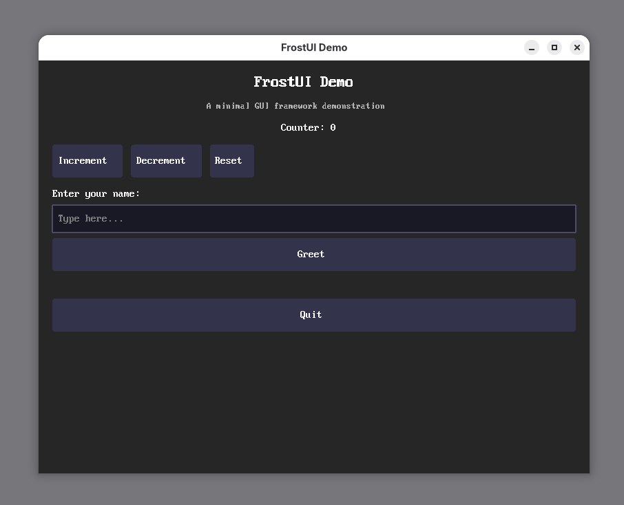
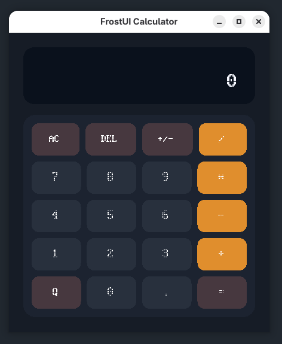
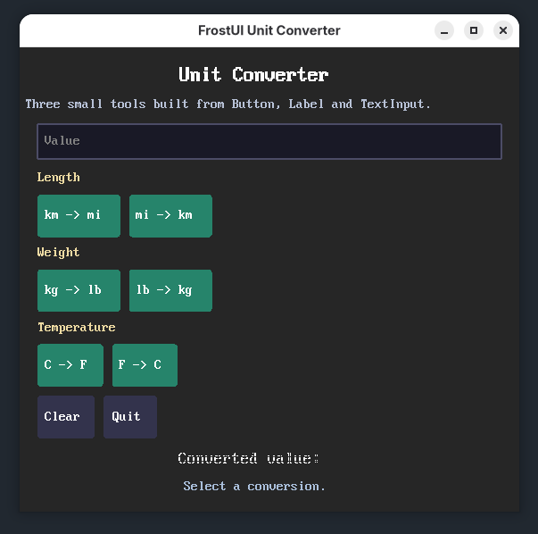

# FrostUI

FrostUI is a small C++20 retained-mode GUI toolkit with a software renderer, platform backends for Linux/X11 and Windows/Win32, and a deliberately compact widget set.

This repository currently exposes enough to build small desktop tools and UI experiments. It does not yet provide a large widget catalog, theming system, scrolling, menus, or rich text/layout primitives.

## What Is Available Right Now

Public API available from [`include/frost/frost.hpp`](/home/fuad/Dev/FrostUI/include/frost/frost.hpp):

- `Application` for the main window, event loop, focus, and rendering
- `Container` with flex-style layout
- `HBox()`, `VBox()`, and `Center()` helpers
- `Label` for text display
- `Button` with `on_click`
- `TextInput` for single-line text entry with `on_text_changed` and `on_submit`
- `PlatformWindow` and platform initialization helpers
- Core utility types such as `Result<T>`, `Signal`, geometry structs, and colors

Current layout controls:

- `FlexDirection`: `Row`, `RowReverse`, `Column`, `ColumnReverse`
- `FlexJustify`: `Start`, `End`, `Center`, `SpaceBetween`, `SpaceAround`, `SpaceEvenly`
- `FlexAlign`: `Start`, `End`, `Center`, `Stretch`
- Per-child flex settings through `Container::set_child_flex()`

Current limitations worth knowing up front:

- only three built-in widgets: `Label`, `Button`, `TextInput`
- `TextInput` is single-line only
- `ContainerStyle.wrap` exists but is marked TODO and is not implemented
- no built-in list, table, checkbox, radio, slider, image, menu, or scroll container
- text measurement is approximate in some widgets
- default rendering path is software rendering; Vulkan is optional and conditional

## Requirements

- C++20 compiler: GCC 11+, Clang 14+, or MSVC 2022+
- CMake 3.20+
- Linux: X11 development headers
- Windows: Visual Studio / Win32 SDK

Linux packages:

```bash
# Ubuntu / Debian
sudo apt install libx11-dev

# Arch
sudo pacman -S libx11

# Fedora
sudo dnf install libX11-devel
```

Optional Vulkan packages:

```bash
# Ubuntu / Debian
sudo apt install vulkan-sdk

# Arch
sudo pacman -S vulkan-devel

# Fedora
sudo dnf install vulkan-devel
```

## Build And Run

```bash
cmake -B build -DCMAKE_BUILD_TYPE=Release
cmake --build build
ctest --test-dir build
```

Example executables:

screenshots





```bash
./build/bin/frost_demo
./build/bin/frost_calculator
./build/bin/frost_unit_converter
```

```powershell
.\build\bin\Release\frost_demo.exe
.\build\bin\Release\frost_calculator.exe
.\build\bin\Release\frost_unit_converter.exe
```

## Tutorial

### 1. Initialize The Platform

```cpp
#include <frost/frost.hpp>
#include <iostream>

using namespace frost;

int main() {
    auto init_result = platform::initialize();
    if (!init_result) {
        std::cerr << init_result.error().message << "\n";
        return 1;
    }

    platform::shutdown();
    return 0;
}
```

### 2. Create The Application Window

```cpp
ApplicationConfig config;
config.window.title = "My FrostUI App";
config.window.width = 800;
config.window.height = 600;
config.window.show_minimize_button = true;
config.window.show_maximize_button = false;

auto app_result = Application::create(config);
if (!app_result) {
    return 1;
}

auto& app = *app_result.value();
```

### 2.1 Optional: Set Window Icons

FrostUI now supports native window icons through raw RGBA pixel buffers in `WindowConfig`.

```cpp
WindowConfig::Icon large_icon;
large_icon.width = 64;
large_icon.height = 64;
large_icon.rgba8 = make_my_64x64_rgba_pixels();

WindowConfig::Icon small_icon;
small_icon.width = 32;
small_icon.height = 32;
small_icon.rgba8 = make_my_32x32_rgba_pixels();

ApplicationConfig config;
config.window.title = "My FrostUI App";
config.window.icons.large = std::move(large_icon);
config.window.icons.small = std::move(small_icon);
```

Notes:

- Windows uses the large and small icons for taskbar/title-bar integration.
- X11 publishes the configured icon sizes through `_NET_WM_ICON`.
- FrostUI does not yet decode `.png` or `.ico` files for you, so you currently provide RGBA bytes directly.
- Minimize/maximize button visibility is fully supported on Win32 and best-effort on X11.

### 3. Build A Widget Tree

FrostUI is retained-mode. You create widgets, connect signals, add them to containers, then set a single root widget on the app.

```cpp
auto root = VBox(12.0f);
root->set_padding(Edges{20.0f, 20.0f, 20.0f, 20.0f});

auto title = Label::create("Hello, FrostUI");
title->set_font_size(24.0f);
title->set_text_align(TextAlign::Center);
root->add_child(std::move(title));

auto input = TextInput::create("Type your name");
auto* input_ptr = input.get();
root->add_child(std::move(input));

auto output = Label::create("Waiting for input...");
auto* output_ptr = output.get();
root->add_child(std::move(output));

auto button = Button::create("Update");
button->on_click.connect([input_ptr, output_ptr]() {
    if (input_ptr->text().empty()) {
        output_ptr->set_text("Please enter a name.");
    } else {
        output_ptr->set_text("Hello, " + input_ptr->text() + "!");
    }
});
root->add_child(std::move(button));
```

### 4. Attach The Root And Run

```cpp
app.set_root(std::move(root));
app.run();
platform::shutdown();
```

## The Core Workflow

Most FrostUI apps follow the same pattern:

1. Call `platform::initialize()`.
2. Create an `Application`.
3. Build a tree of `Container`, `Label`, `Button`, and `TextInput`.
4. Store raw pointers before moving widgets into containers if you need to update them later.
5. Connect signals like `Button::on_click` or `TextInput::on_submit`.
6. Call `app.set_root(...)`.
7. Enter `app.run()`.
8. Call `platform::shutdown()` before exit.

The common retained-mode pattern looks like this:

```cpp
auto label = Label::create("0");
auto* label_ptr = label.get();

auto button = Button::create("Increment");
button->on_click.connect([label_ptr]() {
    label_ptr->set_text("1");
});
```

## Layout Tutorial

### Simple Stacks

```cpp
auto column = VBox(16.0f);
auto row = HBox(8.0f);
auto centered = Center();
```

### Full Container Control

```cpp
ContainerStyle style;
style.direction = FlexDirection::Row;
style.justify = FlexJustify::SpaceBetween;
style.align_items = FlexAlign::Center;
style.gap = 12.0f;

auto toolbar = Container::create(style);
```

### Flex Growth

```cpp
auto row = HBox(12.0f);

row->add_child(Label::create("Fixed"));
row->add_child(TextInput::create("Expands"));

row->set_child_flex(0, FlexItem{.grow = 0.0f, .shrink = 0.0f});
row->set_child_flex(1, FlexItem{.grow = 1.0f, .shrink = 1.0f});
```

## Widget Reference

### `Label`

Use it for static or dynamically updated text.

```cpp
auto label = Label::create("Status: ready");
label->set_font_size(18.0f);
label->set_text_color(Color{0.4f, 0.8f, 0.4f, 1.0f});
label->set_text_align(TextAlign::Center);
label->set_vertical_align(VerticalAlign::Middle);
```

### `Button`

Use it for click actions.

```cpp
auto button = Button::create("Save");
button->on_click.connect([]() {
    // handle click
});
```

Custom style:

```cpp
ButtonStyle style;
style.background_color = Color{0.18f, 0.40f, 0.70f, 1.0f};
style.hover_color = Color{0.24f, 0.48f, 0.80f, 1.0f};
style.pressed_color = Color{0.12f, 0.30f, 0.58f, 1.0f};

auto primary = Button::create("Primary", style);
```

### `TextInput`

Use it for single-line input.

```cpp
auto input = TextInput::create("Search...");
input->on_text_changed.connect([](const String& text) {
    // react to typing
});
input->on_submit.connect([](const String& text) {
    // react to Enter
});
```

## Example UIs Included In This Repo

### `frost_demo`

Located at [`examples/demo/main.cpp`](/home/fuad/Dev/FrostUI/examples/demo/main.cpp)

- counter controls
- text input and greeting action
- basic vertical and horizontal layout composition

### `frost_calculator`

Located at [`examples/calculator/main.cpp`](/home/fuad/Dev/FrostUI/examples/calculator/main.cpp)

- two text fields for operands
- add, subtract, multiply, divide actions
- result and validation messaging

### `frost_unit_converter`

Located at [`examples/unit_converter/main.cpp`](/home/fuad/Dev/FrostUI/examples/unit_converter/main.cpp)

- one input field
- length, weight, and temperature conversions
- grouped button rows that mimic small tool panels

## More UI Ideas You Can Build With The Current API

These are realistic with today’s widget set:

- a login form with username, password, status message, and submit button
- a settings panel with grouped labels, text inputs, and apply/reset actions
- a pomodoro timer UI driven by labels and buttons
- a color value converter for RGB, HEX, and HSL text fields
- a tiny note app with title field, body preview label, and save button

## Project Layout

```text
include/frost/
  frost.hpp
  core/
  platform/
  graphics/
  ui/

examples/
  demo/
  calculator/
  unit_converter/

src/
  core/
  graphics/
  platform/
  ui/

tests/
```

## Notes For Contributors

If you add a new widget or layout feature, update:

- [`include/frost/frost.hpp`](/home/fuad/Dev/FrostUI/include/frost/frost.hpp) if it is public
- [`README.md`](/home/fuad/Dev/FrostUI/README.md) so the available API stays accurate
- [`examples/CMakeLists.txt`](/home/fuad/Dev/FrostUI/examples/CMakeLists.txt) if the change includes a runnable example

## License

MIT
